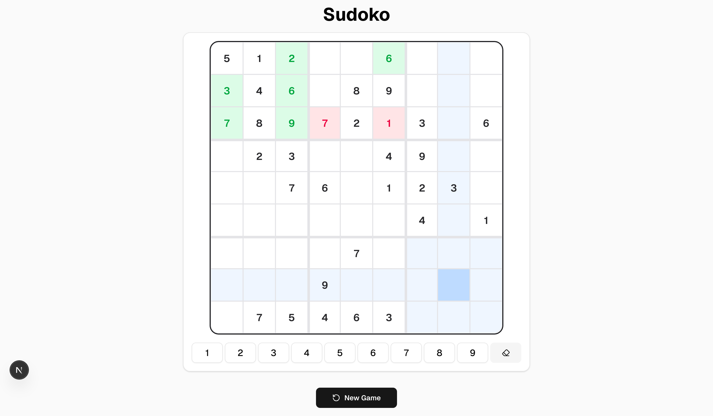
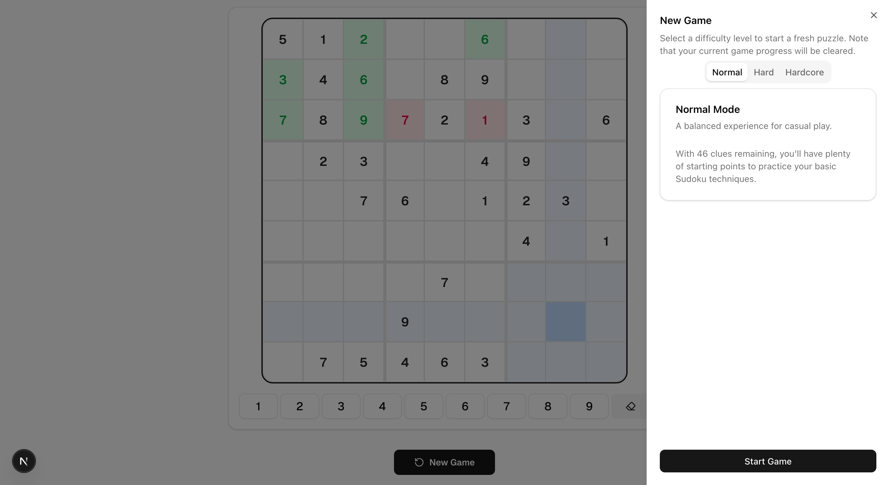

# 🧩 Sudoko

This repository contains the Java backend for **GA mini project** (February 2026). The project is a custom backtracking
algorithm for puzzle generation and a robust file-based storage system for game persistence.

## 🌟 Features

* **Sudoku Engine:** Custom backtracking algorithm to ensure unique solutions.
* **Board Utilities:** Specialized BoardUtils for 2D-to-String transformations and 2D cloning.

## 🚦 API Reference

| Method | Endpoint         | Description                        | Request Body                                                              | Status Codes              |
|:-------|:-----------------|:-----------------------------------|:--------------------------------------------------------------------------|:--------------------------|
| `POST` | `/sudoku`        | Generate and save a new puzzle     | `{ "difficulty": "HARD"}`                                                 | `201 Created`             |
| `GET`  | `/sudoku/{id}`   | Retrieve a specific puzzle by UUID | None                                                                      | `200 OK, 404 Not Found`   |
| `POST` | `/sudoku/submit` | Validate a user's submission       | `{ "uuid": "Cannot be null", "playerSolution": "Must be 81 characters" }` | `200 OK, 400 Bad Request` |

## 🧩 Game UI Preview

### 🔹 Cell Highlighting Demo
This image shows a sample Sudoku board with numbers filled in, demonstrating how the **selected cell is highlighted** along with its row, column, and matching values. This helps the player visually track patterns and avoid mistakes.

---

### 🔹 New Game Sheet & Difficulty Selector
This image demonstrates the **New Game sheet**, where the user can choose the puzzle difficulty (Easy / Medium / Hard) before starting a new game.

---

## 🌐 Frontend Repository

The frontend for this project is developed separately using **Next.js + Tailwind CSS**.

👉 **Frontend Repo:**  
https://github.com/wesamAlsaleh/sudoko-f

## 🤝 Contribution

This project was developed solely as part of the GA Java Bootcamp curriculum.

## 👨‍💻 Author

**Wesam Alsaleh**

* [GitHub Profile Link](https://github.com/wesamAlsaleh)

## 📜 License

This project is open-source and available under the MIT License.